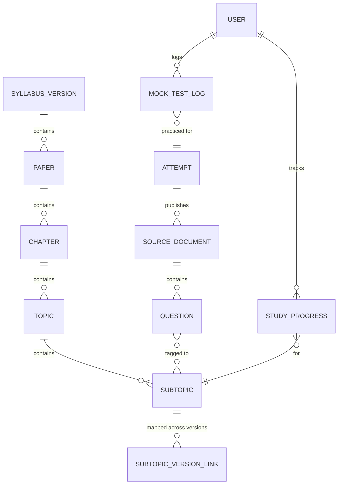
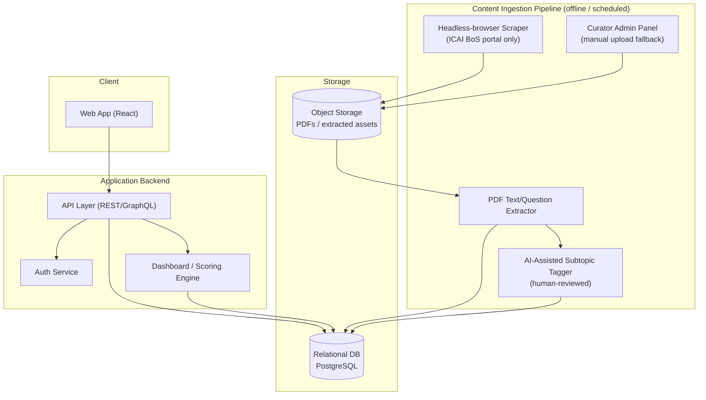

# System Design Document
## CA Final Study Companion — "One Place for CA Final Prep"

| | |
|---|---|
| **Document type** | System Design Document (v1.0) |
| **Prepared for** | Internal build — brother + close friends (Phase 1), SaaS-track (Phase 2+) |
| **Platform** | Web application |
| **Status** | Draft for engineering kickoff |

---

## 1. Purpose & Product Vision

CA Final aspirants currently spread their preparation across many disconnected sources: the ICAI study material PDFs, RTPs, MTPs, past-year question papers, suggested answers, coaching notes, and their own handwritten trackers. Nothing tells a student, at the moment they're studying a specific subtopic, *"this exact concept was asked in Nov 2023 for 8 marks — here's the question and the model answer."*

The vision is a single web app that:

1. Organizes the entire CA Final syllabus into a strict, navigable hierarchy — **Paper → Chapter → Topic → Subtopic**.
2. Lets a student mark subtopics as studied and see real progress, not guesswork.
3. Surfaces exam-relevant intelligence (which subtopic has historically been tested, how often, for how many marks, with what answer) right where the student is studying — not as a separate PDF they have to cross-reference manually.
4. Reduces "what should I study next" anxiety through a dashboard that tells the student where they stand and what's next.

**Non-goal for Phase 1:** replacing ICAI study material content, live classes, or acting as a coaching platform. This is a *study operating system*, not a content publisher — it organizes and contextualizes official content, it doesn't try to rewrite it.

---

## 2. Scope Decisions (from requirements discussion)

| Decision point | Chosen direction | Implication on design |
|---|---|---|
| Initial audience | You (engineer) + brother + a few friends — a trusted, small user base | Build multi-user from day 1 (don't hardcode single-user assumptions), but skip billing/subscription infrastructure until Phase 2 |
| Platform | Web app only, kept simple | No native mobile app in Phase 1; responsive web is the only client surface |
| Future direction | Possible SaaS + monetization if it works out | Architecture must be **multi-tenant-ready** (user/account model, isolated progress data) even though there's no payment wall yet — retrofitting multi-tenancy later is expensive; retrofitting billing later is cheap |
| Content ingestion | Automated scraping **only from the official ICAI/BoS source**, no third-party test-series sites; if scraping proves infeasible, build the structural metadata now and plug content in later | Architecture separates the **taxonomy layer** (papers/chapters/topics/subtopics — built and populated now, by hand if needed) from the **content layer** (PDFs, extracted questions — populated by an ingestion pipeline that may start semi-manual and become automated) |

---

## 3. Important Constraints Discovered During Research

These materially shape the design and should be treated as first-class requirements, not footnotes:

1. **ICAI now conducts CA Final exams three times a year (January, May, September)**, not twice. Any "trend across attempts" feature must handle a growing, irregular cadence of attempts — don't hardcode "May/Nov."
2. **The syllabus itself changes across attempts.** ICAI moved from an 8-paper old scheme to a 6-paper new scheme, and even within the new scheme, papers are revised (e.g., Paper 6 — Integrated Business Solutions — became open-book, case-study-based, 5 case studies of 25 marks with 4 to be attempted). A chapter/topic that existed in a Nov 2022 RTP may not map 1:1 to a chapter in the May 2026 syllabus. **The data model must version the taxonomy itself**, not just the questions.
3. **boslive.icai.org is JavaScript-rendered and has bot-detection.** A naive `requests`/`curl` scraper will not work. Any scraping component needs a headless-browser approach (e.g., Playwright) with careful, low-frequency, identifiable, ToS-respecting access — and a human-in-the-loop fallback, since automated access to ICAI's portal is not guaranteed to remain reliable or permitted.
4. **Copyright.** ICAI study material, RTPs, MTPs, and suggested answers are ICAI's copyrighted content. Storing copies for a small private group for personal study is a materially different risk profile than redistributing that content inside a monetized public SaaS product. This is flagged in §12 (Compliance) as something to get explicit legal comfort on **before** Phase 2, not after.

**Current CA Final paper structure (new scheme, applicable May 2026 onward)** — used as the seed taxonomy:

| Group | Paper | Name |
|---|---|---|
| Group 1 | Paper 1 | Financial Reporting |
| Group 1 | Paper 2 | Advanced Financial Management |
| Group 1 | Paper 3 | Advanced Auditing, Assurance and Professional Ethics |
| Group 2 | Paper 4 | Direct Tax Laws & International Taxation |
| Group 2 | Paper 5 | Indirect Tax Laws (Part I: GST, Part II: Customs & FTP) |
| Group 2 | Paper 6 | Integrated Business Solutions (Multi-disciplinary case study, open-book) |

---

## 4. Personas

- **The Student (primary user).** Logs in, sees a dashboard, drills into a paper, studies a subtopic, checks it off, sees what's historically been asked from it.
- **The Content Curator (you, initially).** Maintains the taxonomy, uploads/attaches official content, tags past questions to subtopics, reviews AI-suggested tags. In Phase 1 this is literally you wearing an admin hat; in Phase 2 this could become a small internal ops role.
- **(Phase 2) The Account Owner / Admin** for a batch/group — e.g., a coaching class admin managing several student accounts, if the SaaS direction is pursued.

---

## 5. Core Feature Set

### 5.1 Syllabus Tree & Study Tracking
- Fixed hierarchy: **Paper → Chapter → Topic → Subtopic**.
- Each subtopic has a checkbox: *Not started / In progress / Done* (three states are more useful than a binary checkbox — "in progress" matters for a dashboard).
- Timestamped: when marked done, when last revised (supports future spaced-repetition features).
- Optional per-subtopic personal notes field (short free text) — small addition, high value, low cost.

### 5.2 Home Dashboard
- **Overall syllabus coverage %** (weighted by chapter, not just by count of subtopics — a subtopic with 2 marks weightage shouldn't count the same as one with 20).
- **Paper-wise coverage** — 6 progress bars, one per paper, with group subtotals (Group 1 / Group 2).
- **Last 7 days progress** — subtopics completed, hours implied (based on timestamps), a simple trend sparkline.
- **Next week's plan** — an auto-suggested list of subtopics to prioritize next, based on: (a) not yet started, and (b) high historical exam weightage (see §5.3). This turns the "trend analysis" feature into an actionable planning feature, not just a trivia display.
- **Weak-attempt-coverage flag** — if a subtopic has been asked in 3+ of the last 5 attempts and is still "Not started," surface it prominently (this is the single highest-value UI element in the whole product).

### 5.3 Historical Question / Trend Intelligence (the differentiator)
For every subtopic, the system stores a linked list of **exam appearances**:

- Which document it came from (RTP / MTP / Past Paper / Suggested Answer), attempt (e.g., "Sept 2025"), and series (MTP Series 1 vs 2).
- The question text (or a structured reference/scan if full-text reproduction is a copyright concern — see §12).
- Marks allotted.
- The suggested/model answer (same reproduction caveat).
- A computed **"frequency score"** for the subtopic: how many of the last N attempts it has appeared in, and total marks across those attempts.

This is shown **inline, exactly where the student is studying that subtopic** — not as a separate "past papers" section they have to search through. That inline placement is the core UX idea of the whole product and should be treated as the thing not to compromise on.

### 5.4 Additional features worth including (beyond what was asked)

These are recommended because they reuse the same taxonomy/tagging infrastructure at low marginal cost, and directly serve the stated goal of "focus on core and important topics":

| Feature | Why it's worth it |
|---|---|
| **Topic-importance score** | A single computed number per topic (frequency × average marks, recency-weighted so a 2019 appearance counts less than a 2025 one) — turns raw history into a prioritization signal. |
| **Amendment / applicability tracker** | Tags each subtopic with "applicable from attempt X" — critical for Tax and Law papers where provisions change every attempt. Directly reuses the taxonomy versioning from §3. |
| **Revision mode / spaced repetition** | Once marked "Done," resurface a subtopic for quick revision after a set interval, prioritized by importance score. Cheap to add once the checkbox + dates + importance score already exist. |
| **Attempt countdown + effort allocator** | Given exam date and remaining hours/day, allocate remaining study time across not-yet-covered high-importance subtopics. |
| **Group progress view (Phase 1, small group)** | Since it's you + brother + friends, a simple "how is everyone doing" comparison view costs little and is exactly suited to this rollout, ahead of any SaaS decision. |
| **Full-text search across notes/content metadata** | Once content exists, search-across-everything is expected by users and cheap with a database index. |
| **Mock-test log** | A simple place to log self-attempted MTP scores per paper/attempt, so a student can see their own score trend alongside the syllabus trend. |

---

## 6. Data Model

### 6.1 Entity-Relationship Overview



### 6.2 Key tables (simplified)

```
syllabus_version(id, name /* e.g. "May 2026 onward" */, effective_from_attempt, effective_to_attempt, notes)

paper(id, syllabus_version_id, code /* P1..P6 */, name, group_no, max_marks)

chapter(id, paper_id, name, sequence, weightage_marks_typical)

topic(id, chapter_id, name, sequence)

subtopic(id, topic_id, name, sequence)

subtopic_version_link(id, old_subtopic_id, new_subtopic_id, relation /* same | split_from | merged_into | renamed */)
  -- lets the trend engine correctly attribute an old question to today's taxonomy

attempt(id, label /* "Jan 2026" */, exam_month, exam_year, sequence)

source_document(id, attempt_id, paper_id, doc_type /* study_material | rtp | mtp | past_paper | suggested_answer */,
                 series /* nullable, e.g. "Series 1" */, source_url, file_ref, ingested_at, ingestion_method /* scraped | manual */)

question(id, source_document_id, question_number, marks, question_text_ref, answer_text_ref, page_ref)
  -- text_ref points to stored/extracted text OR to a citation-only reference if full reproduction is restricted (see §12)

question_subtopic_tag(id, question_id, subtopic_id, tag_confidence, tag_source /* human | ai_suggested_confirmed */)

user(id, email, name, role /* student | curator | admin */, account_id)

account(id, name, plan /* free | (future) paid */) -- multi-tenancy seed, unused billing-wise in Phase 1

study_progress(id, user_id, subtopic_id, status /* not_started | in_progress | done */, last_studied_at, note_text)

mock_test_log(id, user_id, attempt_id, paper_id, score, max_score, logged_at)
```

The **`subtopic_version_link`** table is the single most important modeling decision in this document — without it, "trend across attempts" silently breaks every time ICAI restructures a paper, which history shows happens regularly.

---

## 7. System Architecture



**Why this shape:** the ingestion pipeline is deliberately **offline and decoupled** from the live app. Scraping ICAI's portal is uncertain (bot detection, possible layout changes, ToS considerations) — it must never be a runtime dependency of the student-facing app. The app only ever reads from the database; how that database got populated (scraper today, manual upload next month) is invisible to the product layer. This is what lets you say "build the structure now, plug in content later" without a rewrite.

---

## 8. Recommended Tech Stack (optimized for "simplest thing that works," small team, one platform)

| Layer | Recommendation | Why |
|---|---|---|
| Frontend + backend | **Next.js (React + API routes/Server Actions), TypeScript** | One codebase, one deploy, no separate backend service to run for a 5–10 user Phase 1. Scales fine to Phase 2 SaaS without a rewrite. |
| Database | **PostgreSQL** (via Supabase or Neon) | Relational fits the strict Paper→Chapter→Topic→Subtopic hierarchy and the many-to-many question↔subtopic tagging naturally. Supabase also bundles auth and storage, reducing moving parts for a small team. |
| ORM | **Prisma** | Type-safe schema matching §6, easy migrations as the taxonomy evolves across attempts. |
| Auth | **Supabase Auth / Clerk / NextAuth** | Email+password or magic link is enough for a 5–10 person Phase 1; the same provider supports org/multi-tenant accounts later. |
| File storage | **S3-compatible object storage** (Supabase Storage / Cloudflare R2) | Store source PDFs and extracted assets separately from the DB. |
| Hosting | **Vercel** (app) + managed Postgres | Zero-ops for a small team; predictable low cost pre-monetization. |
| Ingestion / scraping runtime | **Node script using Playwright**, run on a schedule (e.g., GitHub Actions cron or a small worker), *not* inside the web app's request path | Keeps a fragile, external-dependency process isolated and observable; failures don't affect the live app. |
| AI-assisted tagging (optional) | **Claude API** to suggest which subtopic a scraped question most likely belongs to, with a confidence score — always routed through curator review before being marked "confirmed" | Cuts manual tagging effort dramatically while keeping a human in the loop for exam-critical accuracy. |

This is a recommendation, not a mandate — if you're already fluent in a different stack (e.g., Django + Postgres, or a Rails app), the architecture in §7 maps onto it just as well. The one hard requirement is: **relational DB + decoupled ingestion**, regardless of framework choice.

---

## 9. Content Ingestion Strategy (phased, given the scraping uncertainty)

**Phase 1a — Taxonomy first (no dependency on scraping at all).**
Manually build and seed the full Paper → Chapter → Topic → Subtopic tree from the official syllabus documents. This alone unlocks the checkbox-tracking and dashboard features (§5.1–5.2) with zero ingestion risk, and gives your brother's group something usable almost immediately.

**Phase 1b — Attempt automated scraping, official source only.**
Build a Playwright-based scraper targeted specifically at `boslive.icai.org`, with:
- A low request rate and clear, honest identification (no attempt to disguise the scraper as a browser to defeat bot detection maliciously — the goal is reliability, not evasion).
- A change-detection layer, since portal layout changes will break selectors; treat this as an expected, monitored failure mode, not an edge case.
- Output limited to **downloading the official PDFs and capturing their canonical URLs** — not attempting to reproduce ICAI's page structure.
- A fallback: if scraping a given attempt's page fails, it queues for manual download via the curator admin panel — the pipeline should never hard-block on scraper failure.

**Phase 1c — Extraction & tagging.**
Run downloaded PDFs through text extraction, split into individual questions (RTP/MTP/Suggested Answers follow a fairly consistent per-paper format, which helps), then use AI-assisted tagging (§8) with mandatory curator confirmation before a tag is treated as ground truth in the trend-analysis feature. **Never surface an unconfirmed tag to students as fact** — a wrong "this was asked for 8 marks" is worse than not showing anything.

---

## 10. Non-Functional Requirements

| Aspect | Phase 1 target | Notes |
|---|---|---|
| Users | 5–15 concurrent | Trivial load; optimize for correctness and low cost, not scale |
| Availability | Best-effort (no formal SLA) | A managed platform (Vercel/Supabase) default uptime is more than sufficient |
| Data integrity | High for study-progress data | Progress data is the thing users will be most upset to lose — back it up |
| Cost | Near-zero / free-tier where possible | Vercel + Supabase/Neon free tiers comfortably cover Phase 1 scale |
| Extensibility to Phase 2 | Multi-tenant-ready schema (account_id on user), no premature billing code | Don't build Stripe integration until there's a real decision to monetize |

---

## 11. Roadmap

1. **MVP (weeks 1–3):** Taxonomy CRUD + seed data for all 6 papers, checkbox tracking, basic dashboard (coverage %, paper-wise bars).
2. **MVP+ (weeks 4–6):** Curator admin panel for manually uploading RTP/MTP/past-paper PDFs and tagging questions to subtopics; inline display of tagged questions on subtopic pages.
3. **Automation (weeks 7–10):** Scraper for ICAI BoS portal, extraction pipeline, AI-assisted tagging with review queue.
4. **Intelligence layer (weeks 11+):** Importance scoring, "next week's plan" suggestions, amendment tracker, revision/spaced-repetition mode, mock-test log.
5. **SaaS readiness (only if Phase 1 group validates value):** billing, multi-account/org management, legal review of content licensing (see §12), broader onboarding.

---

## 12. Compliance & Risk Notes (read before Phase 1b)

- ICAI's study material, RTPs, MTPs, and suggested answers are copyrighted. For a small private-use group, storing copies for personal study is lower-risk than it would be for a monetized public product redistributing that same content to strangers. **Before any Phase 2 SaaS move, get explicit clarity (ideally legal advice, or direct confirmation from ICAI) on what can be stored/displayed versus what must remain a link-out to the official portal.**
- Consider, as a safer default even in Phase 1, storing **structured metadata about a question (attempt, marks, subtopic, a short paraphrase) plus a link/reference to the official source**, rather than verbatim full-text reproduction of ICAI's question and answer text — this reduces risk without losing the core "was this asked before, and how" value.
- Respect the source site's terms of use and `robots.txt` in the scraper design; build in the manual fallback (§9) specifically so the product's usefulness never depends on defeating access controls.

---

## 13. Open Questions for Next Iteration

- Should Phase 1's taxonomy be typed in by hand from the official syllabus PDF, or is there an authoritative machine-readable syllabus source worth checking first?
- What attempt range should trend analysis start from (e.g., last 3 years only, to stay relevant to the current syllabus) versus the full historical archive?
- Do you want mock-test score logging to be self-reported only, or eventually support uploading ICAI's own MTP evaluation if that ever becomes available digitally?

---
*End of document.*
