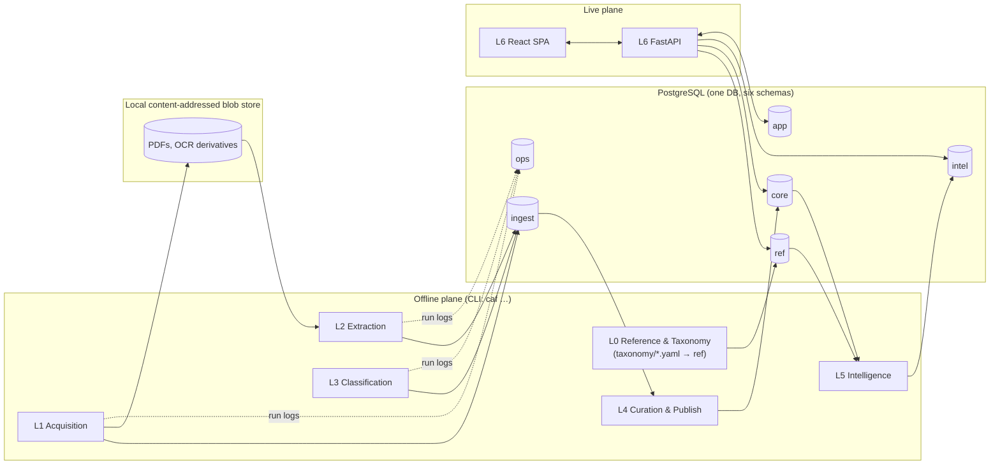

# Technical Implementation Plan — v2.0
## CA Final Study Companion — Engineering Source of Truth

| | |
|---|---|
| **Document type** | Technical Implementation Plan (v2.0) — supersedes v1.0 |
| **Status** | Approved baseline for development |
| **Companion documents** | `CA_Final_Study_Tool_System_Design.md` (product intent), `CA_Final_Detailed_Implementation_Guide.md` (execution detail for every layer defined here) |
| **Precedence** | Where this plan and the System Design conflict, **this plan wins**. Every such conflict is listed explicitly in §11. |
| **Audience** | Whoever builds or modifies any part of the system |

---

## 0. How to use this document

This plan defines **what** each layer is responsible for, **which approach** it uses and why, and — most importantly — the **interface contract** between every pair of layers. The companion *Detailed Implementation Guide* defines **how** each layer is executed step by step, including schemas, algorithms, prompts, and failure runbooks.

Rules of engagement:

1. A change *inside* a layer that preserves its contracts (§4) is an implementation decision — record it in the Detailed Guide.
2. A change to a contract (§4), to the layer model (§3), or to a decision in §1 is an **architecture change** — it requires updating this document first, with a dated entry in §13.
3. If the code and this document disagree, the document is wrong or the code is wrong — never both "sort of right." Fix one of them.

---

## 1. Decision record (inputs to this revision)

| # | Question | Decision | Consequence |
|---|---|---|---|
| D1 | Who uses it, where does it run? | **Single user, local-first.** One person is both the student and the curator. | No auth system, no tenancy. `user_id` still exists on all user-owned rows (one seeded user) so multi-user is a migration, not a rewrite. Runs on one machine; optional private access from phone via a private network overlay (e.g., Tailscale). Never exposed publicly. |
| D2 | What content is stored and shown? | **Store privately, display metadata.** PDFs and extracted text are stored locally for processing. The student-facing UI shows attempt, marks, label, a short AI-written *gist* (≤25 words, curator-approved) and a **deep link to the exact page of the official PDF**. | The student-facing API never returns full question/answer text. Extraction errors can never mislead the student about *what the question said*, because the student always reads the original page. |
| D3 | When is a subtopic tag trusted? | **Human-confirmed only.** Nothing reaches the student view without the curator accepting it. Auto-accept exists only as a config flag, off by default, and may be switched on only for a confidence bucket whose measured precision on a reviewed sample is ≥97% (n ≥ 200). | The LLM's job is to make review *fast*, not to replace it. Review UX is a first-class deliverable, not an afterthought. |
| D4 | How deep into the archive? | **Incremental, gated depth.** Newest attempts first; each older year is added only if a measurable *Depth Gate* (§7) says it is worth the human review time. The automated stages run ahead cheaply; the human review is what is gated. | Depth is configuration, not code. Paper-specific cut-offs apply where law changed (e.g., pre-GST indirect tax). |
| D5 | Where does the taxonomy come from? | **Derived from ICAI study-material headings** (PDF bookmarks/outline first, font-structure fallback), then curator-edited. Subtopic ≈ lowest meaningful study-material sub-heading. Stored as **taxonomy-as-code** (YAML in the repo), loaded into the database. | Taxonomy authoring goes from weeks of typing to days of editing. Every taxonomy change is a reviewable diff with history. |
| D6 | What counts toward trend signals? | **Exam signal** = question papers + suggested answers of actual attempts. **Practice signal** = RTP, MTP, case-scenario booklets, Paper 6 case studies. Study-material illustrations / "Test Your Knowledge" are **excluded** from Phase 1. | The two signals are stored and scored separately. "Asked in 3 of the last 5 attempts" means *actual exams only*. |
| D7 | Stack & model provider | **Python (FastAPI) + React/Vite/TypeScript. Google Gemini API, Flash-Lite / Flash tiers.** | Provider is behind a thin interface; model IDs live in config, never in code (Gemini model IDs churn every few months). See §6.3 for billing notes. |
| D8 | Precedence | This plan overrides the System Design where they conflict. | §11 lists every deviation. |

---

## 2. Critique of v1.0 — what changed and why

This section exists so nobody "fixes" v2 back to v1 without knowing why v1 was changed.

| Area | v1.0 decision | Verdict | v2.0 decision | Why |
|---|---|---|---|---|
| Layer model | 5 layers: Acquisition, Parsing, Classification, Storage, Serving | **Wrong axis in two places** | 7 layers, L0–L6 (§3) | "Storage" is not a pipeline stage — every layer writes to it. Treating it as step 4 hid the only boundary that matters: *staging vs. published*. Three things with real logic had no home: taxonomy authoring, human curation, and the scoring engine (the product's differentiator was reduced to "dashboard queries"). |
| Taxonomy | "Hand-seed the current syllabus" | **Under-specified; the riskiest manual task in the project was one line** | L0 — derived from study-material outlines, taxonomy-as-code, stable IDs, descriptors, anchor index | 1,500–3,000 subtopics cannot be responsibly hand-typed without tooling. Classification quality depends directly on subtopic *descriptors*, not just names. |
| Historical taxonomies | Classify old questions against the taxonomy *in force at that attempt*, then map forward via `subtopic_version_link` | **Rejected** | Classify every question directly against the **current** taxonomy. `subtopic_version_link` is kept only for **future** revisions of the current taxonomy. | v1 required authoring a full taxonomy for every past scheme (there are at least two older Final schemes), plus the mappings. That multiplies the most expensive manual work for no gain: the student only ever studies the current taxonomy. |
| Acquisition method | Playwright for everything; human passes bot-check, script reuses the session | **Over-engineered and conflicts with the design's no-evasion rule** | HTTP-first discovery for server-rendered pages; browser only where pages are JS-rendered; **assisted mode** (human drives, tool records) wherever `robots.txt` or a human check applies | The ICAI archive pages on icai.org are server-rendered and link directly to PDFs on `resource.cdn.icai.org`. Reusing a session to keep automating past a bot check is circumvention, whatever it's called. |
| Manifest | File on disk + copy of fields in `source_document` | **Two sources of truth** | Manifest *is* the `ingest.document` table | One place to query what exists, what failed, and what is pending. |
| Parsing | Layout library finds boundaries; LLM extracts fields and "cleans" text | **Inverted risk** | Deterministic segmentation first (profiles + validators); LLM used only as a **fallback segmenter that returns block IDs, never text** | ICAI documents are highly regular — regex anchors on a positioned text stream handle most of them. An LLM re-typing FR/AFM/DT computation answers can silently change numbers. Returning block IDs makes hallucinated text impossible by construction. |
| Marks validation | "Marks sum to paper total" | **Wrong for CA Final** | Choice-aware validation (compulsory + best-k optional, OR-alternatives counted once) | Papers have internal choice (e.g., Q1 compulsory, any 4 of the rest; Paper 6: 4 of 5 case studies), so the raw sum legitimately exceeds 100. |
| Classification | RAG (embed subtopic names, top-k) + LLM judge picks from shortlist | **Unnecessary complexity with a hard recall ceiling** | Cascade: source-structure prior → deterministic **anchor index** (Ind AS / AS / SA / section numbers) → hierarchical LLM classification over the full paper taxonomy (chapter, then subtopic) → human review | The paper is already known from document metadata, and one paper's taxonomy fits in a prompt. Embedding short names ("Exceptions", "Applicability") retrieves poorly; if the right subtopic is not in the top-k, the judge confidently picks a wrong one. |
| Confidence | LLM self-reported confidence; high → auto-accept | **Uncalibrated; conflicts with the design's "never surface unconfirmed tags"** | Confidence = agreement across two permuted runs + anchor consistency, bucketed A–D; calibrated against reviewed data; human confirmation required (D3) | Verbalised LLM confidence is not a probability. |
| Signals | RTP/MTP/Past papers all feed "frequency" | **Conflation** | Separate exam and practice signals (D6) | An RTP question was never "asked in the exam." Counting it inflates frequency. |
| Study material parsing | Parse study material into sections for "content reference" | **No consumer for that output** | Study material feeds **L0 only** (taxonomy + descriptors) | Build what a feature consumes. |
| Storage engine | Local Postgres | **Agree** | Local Postgres 16 in Docker, with separate schemas and DB roles enforcing the staging/published boundary | — |
| Backend/frontend | FastAPI + React/Vite | **Agree** | Same; single process serves API and the built SPA; TypeScript client generated from OpenAPI | Shared Python with the pipeline is a real advantage. OpenAPI generation makes the L6 contract machine-checked. |
| Orchestration | Independent checkpointed scripts, no Airflow | **Agree** | One CLI (`caf`) with per-stage commands; stage state lives in DB status columns (which act as the queue) | — |
| Breadth-first everywhere | Breadth-first by attempt in every layer | **Partly wrong** | Acquisition: breadth-first (cheap). Processing: **value-first** — exam documents newest-first, then practice documents, then older years through the Depth Gate. Parser *development*: depth-first per document profile. | Breadth-first parsing before a profile is proven multiplies rework across every attempt. |
| Dashboard "hours implied by timestamps" | (from System Design) | **Rejected** | Show completed subtopics; optional explicit study-session logging | Timestamps of checkbox clicks don't imply hours studied. A fabricated metric is worse than none. |

---

## 3. Architecture

### 3.1 Layer model

| Layer | Name | Responsibility (one sentence) | Mode | v1 mapping |
|---|---|---|---|---|
| **L0** | Reference & Taxonomy | Owns the canonical syllabus tree, subtopic descriptors, anchor index, scheme/attempt registry, weightages and applicability rules. | Authoring (offline) | *new* |
| **L1** | Acquisition | Discovers, catalogues and downloads official ICAI documents with verified metadata and provenance. | Offline batch | L1 |
| **L2** | Extraction | Turns each confirmed document into a tree of validated *units* (case stems, questions, sub-parts, MCQs) with marks, page references and paired answers. | Offline batch | L2 |
| **L3** | Classification | Proposes subtopic tags and a gist for each unit, with an evidence-based confidence bucket. | Offline batch | L3 |
| **L4** | Curation & Knowledge Store | Human review of documents and tags; the **publish boundary** that turns staging data into trusted knowledge; data governance and taxonomy migrations. | Offline, human-in-the-loop | L4 (redefined) |
| **L5** | Intelligence | Computes versioned derived signals: exam/practice scores, frequency, importance, coverage weights, weak-coverage flags, plans, revision queue, Depth Gate metrics. | Triggered batch + request-time for per-user parts | *new* (was hidden inside L4/L5) |
| **L6** | Serving | FastAPI + React app: study views, dashboard, progress, notes, mock-test log, and the curator views. | Live | L5 |

### 3.2 Two planes, one database

**Invariant (non-negotiable):** the live plane has **no code path** into L1–L3 and never calls an LLM or the ICAI site. The curator views in L6 call L4 functions — which read `ingest` and write `core` — but never trigger L1–L3.

### 3.3 Data zones (Postgres schemas) and who may write them

| Schema | Contents | Writer | Readers | Rebuildable? |
|---|---|---|---|---|
| `ref` | Schemes, attempts, papers, doc types, taxonomy nodes, descriptors, anchor index, weightages, applicability, version links | L0 loader only | all | Yes, from `taxonomy/*.yaml` + reference docs |
| `ingest` | Documents (manifest), blobs index, units, answer pairs, tag suggestions, gists | L1, L2, L3 | L4, L5 (shadow mode only) | Yes, but costs LLM spend + time |
| `core` | **Published** appearances and tags, curation decisions, change log | L4 only | L5, L6 | **No** — contains human decisions. Back up. |
| `intel` | Derived scores and metadata | L5 only | L6 | Yes, deterministically from `core` + `ref` |
| `app` | User, settings, progress, notes, revision events, mock-test log, study sessions | L6 (student endpoints) | L5, L6 | **No** — irreplaceable. Back up. |
| `ops` | Pipeline runs, LLM call ledger, cost, errors | L1–L5 | curator views | Not needed for function |

Boundaries are enforced by **database roles**, not by discipline:

| Role | Grants |
|---|---|
| `caf_pipeline` | R `ref`; RW `ingest`, `ops` |
| `caf_curator` | R `ref`, `ingest`, `app`; RW `core`, `intel`, `ops`; RW `ref` for the L0 loader |
| `caf_app` | R `ref`, `core`, `intel`; RW `app` |

The FastAPI process holds two connection pools: `caf_app` for student endpoints and `caf_curator` for `/api/v1/curate/*`. A bug in a student endpoint *cannot* write published knowledge.

---

## 4. Interface contracts

These seven contracts are the architecture. Every contract has a physical form (tables or schema), a Pydantic model in `packages/contracts`, and invariants that are tested.

| ID | Producer → Consumer | Physical form | Readiness predicate (what "available to the next layer" means) | Key invariants |
|---|---|---|---|---|
| **C0** Taxonomy & reference | L0 → L1, L2, L3, L5, L6 | `ref.*` tables, sourced from `taxonomy/*.yaml` | Loaded by `caf taxonomy load` with a successful validation pass | Node IDs are opaque, authored once, **immutable**, never hard-deleted (deprecate instead). Each node has exactly one parent. Every applicable subtopic has a descriptor. |
| **C1** Document | L1 → L2 (and → L0 tooling for reference docs) | `ingest.document` + blob file | `acq_status='acquired' AND catalog_status='confirmed'` | Blob exists and its SHA-256 matches. Metadata (scheme, attempt, paper, doc_type, series, part) was confirmed by the curator. Blobs are immutable; a changed file at the same URL is a *new document version*. |
| **C2** Unit | L2 → L3 | `ingest.unit`, `ingest.unit_answer` | `ingest.document.extract_status IN ('ok','ok_with_warnings')` for the current `extract_run_id` | Every unit has `label_path`, `kind`, page span, `fingerprint`, and (for gradable leaves) integer `marks`. Text is copied from the PDF, never generated. |
| **C3** Suggestion | L3 → L4 | `ingest.tag_suggestion`, `ingest.unit_gist` | `ingest.unit.classify_status='suggested'` | Every suggestion references a valid current-taxonomy node, has `method`, `bucket` (A–D), evidence, `run_id`, model ID and prompt version. L3 **never** overwrites a unit that has a curator decision. |
| **C4** Published knowledge | L4 → L5, L6 | `core.appearance`, `core.appearance_tag` | Row exists (publication is atomic) | Only human-confirmed tags (D3). Each appearance carries its `signal_class` (exam / practice), attempt, marks, official URL + page, gist, `law_stale` flag, and `unit_fingerprint` for re-parse reconciliation. |
| **C5** Scores | L5 → L6 | `intel.subtopic_score`, `intel.score_run` | Latest `intel.score_run.status='ok'` | Every score row carries `scoring_version` and `computed_at`. L6 reads only the latest successful run (atomic swap). |
| **C6** API | L6 backend → L6 frontend | OpenAPI document at `/api/v1/openapi.json`; generated TS client | Committed `openapi.json` equals the generated one (CI check) | Versioned under `/api/v1`. Student endpoints never return full source text (D2). Breaking changes require `/api/v2`. |

**Why these contracts should not need architectural change later:**

- **More users?** `user_id` is already on every `app` row; add auth in L6 and an `account_id` column. No other layer changes.
- **Another LLM provider?** Change the adapter behind the L3 interface. The C3 schema is provider-agnostic.
- **ICAI changes the syllabus?** L0 migration using `subtopic_version_link` (forward-only), with re-queued review of affected tags. C4 rows keep stable subtopic IDs.
- **Better parser?** Re-run L2 and reconcile via `unit_fingerprint`. Published knowledge is never silently dropped.
- **New document type** (e.g., a new ICAI booklet)? Add a row to `ref.doc_type` with its `signal_class`, plus an L2 profile. No schema change.
- **Hosting later?** L6 is already a single deployable process. Copyright review becomes the gating item, not the architecture.

---

## 5. Layer plans

Each subsection covers: responsibility, approach, inputs/outputs, Definition of Done (DoD), and key risks. Execution detail lives in the Detailed Guide: Guide §2 = L0, §3 = L1, §4 = L2, §5 = L3, §6 = L4, §7 = L5, §8 = L6.

### 5.0 L0 — Reference & Taxonomy

**Responsibility.** The canonical model of the syllabus and exam system, which every other layer depends on.

**Approach.**

1. **Registries as data.** Schemes, attempts (with exam month and year; cadence is irregular — Jan/May/Sep now, two per year earlier), papers per scheme, and document types with their `signal_class` are all YAML data, verified against ICAI announcements. Nothing about cadence or paper lists is hard-coded.
2. **Taxonomy bootstrap.** For each current-scheme paper:
   - Read the study-material PDFs' outlines (bookmarks). If outlines are missing, fall back to font-size/bold heading detection.
   - Propose Chapter → Topic → Subtopic.
   - The curator edits the YAML.
   - Granularity guard: target 8–40 subtopics per chapter.
3. **Descriptors.** For every subtopic: a 1–2 line description, keywords, and anchors (standard/section references). These are drafted by the LLM from the matching study-material section and approved by the curator. Descriptors are what make classification accurate. Names alone are not enough.
4. **Anchor index.** A map from (instrument, number) to subtopic(s), e.g., `(IndAS, 116)`, `(SA, 700)`, `(ITA1961, 80C)`, `(CGST, 16)`.
   - It is **instrument-aware** because statutes change. The Income-tax Act, 2025 replaces the 1961 Act, so section numbers differ between old and new questions. Both acts are mapped.
5. **Weightages & applicability.** ICAI's section-wise weightage ranges supply the chapter weights; the midpoint is used. ICAI Study Guidelines supply per-attempt exclusions and inclusions.
6. **Taxonomy-as-code.** YAML in git, loaded by an idempotent loader that validates before writing. Changes to existing nodes (rename, split, merge, deprecate) are declared in YAML and produce a migration plan that is reviewed before it is applied.
7. **Paper 6 (IBS).** Paper 6 gets a thin taxonomy of its own, built from ICAI's Paper 6 skill/area weightage and used for P6 progress tracking. P6 questions are *additionally* tagged to P1–P5 subtopics (§5.3).

**Output.** C0.

**DoD.**
- All 6 current papers are loaded.
- 100% of applicable subtopics have approved descriptors.
- Anchor index is populated for P1 (Ind AS), P3 (SA/SQC/SQM), P4 (both income-tax acts) and P5 (CGST/IGST/Customs).
- Weightages are loaded for all papers.
- The loader passes all validations.

**Key risks.**
- Heading structure is inconsistent between papers → per-paper manual edit budget.
- Wrong granularity → guard rule plus the "none fits" signal from L3 feeding back into L0.

### 5.1 L1 — Acquisition

**Responsibility.** Get official documents onto disk with *correct, confirmed* metadata and full provenance. Nothing else.

**Approach.**

1. **Source registry** (`config/sources.toml`): seed pages, each with a fetch mode:
   - `http` — server-rendered icai.org pages;
   - `browser` — JS-rendered boslive pages; Playwright is used for link discovery only;
   - `assisted` — a headed browser that *you* drive while the tool records PDF links it sees.

   Any path disallowed by `robots.txt`, or that presents a human check or login, is automatically demoted to `assisted`. There is no CAPTCHA solving and no replaying of sessions to automate past checks.
2. **Discovery → catalogue.**
   - Candidate PDF links are collected with their anchor text and breadcrumb context.
   - Metadata is inferred by deterministic rules on anchor text, URL and breadcrumb.
   - Unresolved items go to curator catalogue review.
   - **Exam and practice documents require curator confirmation of their metadata before extraction.** A misattributed attempt corrupts every downstream trend; confirming a few hundred rows in a table is cheap.
3. **Download.**
   - Polite rate: roughly one request per 5–10 seconds per host, with jitter.
   - Honest User-Agent with contact info.
   - Conditional GETs on re-checks.
   - PDF signature and page-count verification.
   - SHA-256 content-addressed storage.
   - Deduplication by hash: the same file at a different URL is recorded as a URL alias. New content at the same URL is recorded as a new version that supersedes the old one.
4. **Manual import.** Drop files into `data/inbox/`, then run `caf acquire import`. The pipeline never hard-blocks on the site.
5. **Ordering.** Acquisition is breadth-first by attempt, newest first. It is cheap, and a complete catalogue is what makes the Depth Gate computable.

**Output.** C1.

**DoD.**
- The catalogue covers all current-scheme exam and practice documents visible on the official sources.
- Every exam/practice document is either `acquired` or explicitly `manual_required` with a logged reason.
- A re-run downloads nothing new when nothing has changed.

**Key risks.**
- Site layout changes → discovery selectors live in config, with a zero-links alarm.
- ICAI removes old files → the local blob store plus backups become the archive of record.
- `robots.txt` restrictions → assisted and manual paths exist by design.

### 5.2 L2 — Extraction

**Responsibility.** Turn a confirmed document into a validated tree of units with marks, page references and paired answers.

**Approach.**

1. **Preflight.** Open the PDF with PyMuPDF and detect whether it has a text layer.
   - Scanned documents go through OCR (`ocrmypdf`/Tesseract). The OCR output is stored as a derived blob; the original is kept.
   - Pages with low OCR quality go to a vision-LLM transcription fallback and are marked `text_origin='llm_transcribed'` (lower confidence, mandatory review).
2. **Positioned block stream.** Build lines/spans with font, size, bold and bbox. Then:
   - strip repeating headers and footers;
   - normalise (dehyphenation, ligatures, rupee symbol, NFKC);
   - give every block a stable ID.
3. **Profile-driven deterministic segmentation.** A YAML profile per (scheme, doc_type[, paper]) defines the regex anchors for:
   - question starts, parts and sub-parts, marks;
   - answer starts, "OR" alternatives, case-scenario stems, MCQ options and MCQ answer-key tables;
   - choice-rule sentences.

   The segmenter builds the unit tree.
4. **Q/A pairing.**
   - Suggested Answers and RTPs usually contain both question and answer: pair within the document.
   - MTP question and answer PDFs are separate: pair across documents by `label_path`, using confirmed metadata. Mismatches are flagged, not guessed.
5. **Validators.**
   - Numbering is monotonic.
   - Every gradable leaf has marks.
   - **Choice-aware** total: attemptable maximum equals the paper maximum.
   - Pairing is complete.
   - Unit length is within bounds (catches merges and splits).
   - MCQs are complete: options present and answer key found.

   The result is `ok`, `ok_with_warnings`, or `needs_review`.
6. **LLM fallback segmenter.** Used only when deterministic validation fails hard.
   - Input: the block stream (IDs plus truncated text).
   - Output: unit boundaries as **block-ID ranges** plus labels. The LLM never returns text.
   - The result must pass the same validators, otherwise it goes to manual override.
7. **Manual override.** For each document, write a per-document YAML override (boundaries by block ID), guided by a generated debug HTML that shows blocks coloured by unit.
8. **Fingerprints.** `sha1(doc_sha256 | label_path | normalised first 200 chars)` enables reconciliation when a document is re-parsed after publication.

**Output.** C2.

**DoD** (per document profile):
- On a hand-checked sample of ≥3 documents per profile, boundary accuracy ≥99%, marks accuracy 100%, and pairing ≥98%.
- Every document in scope is `ok`, `ok_with_warnings`, or has an override.

**Key risks.**
- Formatting drift across years → profiles are versioned per scheme and era; drift shows up as validator failures, never as silent errors.
- MCQ answer keys printed as tables → a dedicated table parser rule in the profile.

### 5.3 L3 — Classification

**Responsibility.** For each unit, propose primary and optional secondary subtopics, a gist, and an evidence-based confidence bucket.

**Unit of classification.**
- The smallest **gradable** unit — a sub-part with marks, or an individual MCQ.
- Case-scenario stems are context, not gradable; their MCQs are classified with the stem attached.

**Cascade (cheapest and most reliable first).**

1. **Source-structure prior.** If the document itself is organised by chapter, the chapter is given.
2. **Anchor extraction.** Deterministic regexes find instrument references in question *and answer* text (the answer is often more diagnostic than the question). These are looked up in the anchor index to produce candidate subtopics.
3. **Hierarchical LLM classification** (Flash-Lite tier, structured JSON output):
   - **Step 1 — chapter.** Choose the chapter (up to 2) from the paper's chapter list plus descriptors. Skipped when anchors are unanimous.
   - **Step 2 — subtopic.** Choose the subtopic(s) within the chosen chapter(s): one primary, up to two secondary. The output also includes a ≤30-word justification and a ≤25-word gist.
   - A **"none fits"** option is mandatory. It routes the unit to the L0 taxonomy-gap queue.
4. **Consistency protocol.** Steps 1–2 run twice, with candidate order permuted and different seeds. If the two runs disagree, a tie-break run uses the stronger Flash tier.
5. **Bucket assignment.**

   | Bucket | Condition |
   |---|---|
   | A | Both runs agree, and anchor-consistent (or no anchor possible) |
   | B | Both runs agree, but the anchor conflicts or the anchor candidates are ambiguous |
   | C | Resolved by tie-break |
   | D | No consensus, or "none fits" |
6. **Duplicate propagation.** A near-duplicate of an already-published unit (MinHash/fuzzy match ≥0.85 — ICAI reuses RTP/MTP questions in exams) inherits that unit's tags as a suggestion, with method `duplicate`, and is linked for display ("also appeared as RTP May 2025 Q4").
7. **Paper 6.**
   - Step 0 picks which of P1–P5 each sub-question draws on.
   - Steps 1–2 then run within those papers.
   - P6-own nodes are tagged too.

**Explicitly removed from v1: embeddings/vector search for classification.**
- The candidate set is bounded by the known paper and fits in context.
- Embeddings may return later *only* for a feature that needs them (e.g., semantic search). That would be a new optional component, not a change to C3.

**Re-run semantics.**
- Re-running never touches units with a curator decision.
- `--shadow` mode writes suggestions under a new run ID for comparison, without affecting the review queue.

**Output.** C3.

**DoD.**
- Precision measured on the first ≥300 reviewed units, reported per bucket and per paper.
- Bucket A top-1 precision ≥95%. Below that, prompts or descriptors must be improved before scaling.
- Taxonomy-gap rate below 3% of units.

**Key risks.**
- Descriptor quality is the main lever — it is owned by L0.
- Model deprecation → model IDs pinned per run; re-evaluate on the reviewed set before switching.

### 5.4 L4 — Curation & Knowledge Store

**Responsibility.** Human judgement, the publish boundary, and data governance.

**Components.**

1. **Catalogue review** (L1 output): confirm or fix document metadata in bulk.
2. **Extraction review:** only documents flagged `needs_review` or `ok_with_warnings`. Shows the debug render and an override editor link.
3. **Tag review** — the main workload.
   - Keyboard-first queue, grouped by document and sorted by bucket.
   - The curator sees full unit text (curator views may), the suggested tags with justification and anchors, the gist, and a link to the source page.
   - Actions: accept, choose alternative, edit, mark none-fits, skip.
   - **Bulk accept of bucket A within a document** is allowed after the list has been displayed. This is still a human decision (D3).
4. **Publish.**
   - A single transaction per document (or per unit) upserts `core.appearance` and `core.appearance_tag`, keyed by `unit_fingerprint`.
   - It writes a `core.change_log` entry and emits a recompute trigger for L5.
   - Publish is idempotent.
5. **Re-parse reconciliation.**
   - When L2 re-runs on an already-published document, units are matched by fingerprint.
   - Unmatched published appearances are flagged `orphaned` for review — **never auto-deleted**.
6. **Taxonomy migrations.** This component applies the migration plan that L0 produces:

   | Change | Handling |
   |---|---|
   | Rename | In place; no re-review |
   | Split | Affected tags re-queued; children inherit the parent's progress status flagged `verify` |
   | Merge | Tags repointed; merged status is the minimum of the sources' statuses |
   | Deprecate | Hidden from students; history retained |
7. **Law-staleness.** For law papers, an appearance before a configured law boundary (e.g., GST introduction; Income-tax Act, 2025 applicability) or older than N attempts gets `law_stale=true`, shown as "answer reflects law at the time."

**Output.** C4.

**DoD.**
- Every published appearance has at least one human-confirmed tag.
- Publish, re-publish and reconciliation are idempotent (tested).
- Change log is complete.

**Key risks.**
- Review fatigue → bucket ordering, bulk accept for A, and session goals in the UI.
- Accidental loss of decisions → `core` is backed up, and L3 cannot overwrite decisions.

### 5.5 L5 — Intelligence

**Responsibility.** Everything the student sees as "insight." Deterministic, versioned, explainable.

**Signals.** Full formulas are in the Guide §7.

| Signal | Definition |
|---|---|
| **Exam score E(s)** | Σ marks attributed to subtopic *s* × time decay with half-life `H_exam` (default 24 months). Marks attributed by tag share: primary 1.0, secondary 0.5, normalised. Decay is by *elapsed time*, not attempt count, because cadence changed. |
| **Practice score P(s)** | Same over practice appearances, `H_practice` = 12 months. |
| **Weightage prior W(s)** | Chapter weightage midpoint × paper max ÷ applicable subtopics in chapter. |
| **Importance I(s)** | `0.6·Ê + 0.2·P̂ + 0.2·Ŵ` (each normalised to 0–1 within the paper). Weights in config. |
| **Frequency F₅(s)** | Number of the last 5 **ingested** exam attempts in which *s* appeared. The denominator only counts attempts whose exam documents are published — an un-ingested attempt is never treated as "not asked." |
| **Weak-coverage flag** | F₅ ≥ 3, status `not_started`, and applicable for the target attempt. |
| **Coverage** | Σ W(s) over done ÷ Σ W(s) over applicable. In-progress is shown separately, not blended. |
| **Next-week plan** | Rank not-done applicable subtopics by I(s), boosted for weak flags. Diversity cap: ≤3 per chapter. Sized by the user's hours per week ÷ minutes per subtopic (configurable). Each item carries a human-readable reason. |
| **Revision queue** | Fixed intervals (3/7/21/60 days) after "done", ordered by I(s). |
| **Depth Gate metrics** | See §7. |

**Execution.**
- Global scores are recomputed after every publish or taxonomy load into a new `intel.score_run`, then swapped atomically.
- Per-user parts (coverage, plan, revision) are computed at request time — single user, trivial cost.

**Output.** C5.

**DoD.**
- Formulas are unit-tested on synthetic fixtures.
- Every number on the dashboard can be explained by an API "why" payload listing contributing appearances.

**Key risk.** Scores computed over incomplete ingestion look authoritative. Mitigation: the dashboard always shows which attempts are ingested per paper.

### 5.6 L6 — Serving

**Responsibility.** The product surface.

**Approach.**
- FastAPI (Python 3.12) serves `/api/v1/*` and the built React SPA from one process, bound to `127.0.0.1`.
- React + Vite + TypeScript, TanStack Query, React Router.
- The TypeScript client is generated from OpenAPI.

**Views.**
- Dashboard.
- Syllabus tree.
- Subtopic page: status, notes, and inline history — appearances with attempt, marks, gist, "open official page" link, duplicate links and law-stale badge.
- Revision.
- Mock-test log.
- Search across taxonomy, descriptors, gists and notes (Postgres full-text search).
- Settings: target attempt, exam date, hours per week.
- Curator area: catalogue, extraction review, tag review, taxonomy gaps, pipeline status.

**Source viewing.**
- Primary: the official URL with `#page=N`.
- Fallback when the official link is dead (checked periodically): open the locally stored copy through a localhost-only endpoint. This is equivalent to opening a PDF already on your own disk.

**Security.**
- Localhost binding by default.
- Remote access only through a private overlay network; never a public port.
- Secrets in `.env`.

**Output.** C6.

**DoD.**
- All views work against real published data.
- The OpenAPI diff check passes in CI.
- An end-to-end smoke test (Playwright) covers: mark a subtopic done → dashboard coverage changes.

---

## 6. Cross-cutting concerns

### 6.1 Lineage and reproducibility

Every offline write carries a `run_id` referencing `ops.run`, which records:

- stage;
- git SHA;
- config hash;
- model IDs and prompt versions;
- start and finish times;
- counts;
- cost.

Any published fact can be traced back to: the curator decision → the suggestion run → the extraction run → the document version → the URL and download time.

### 6.2 Configuration

| File | Contents |
|---|---|
| `config/settings.toml` | Paths, DB URLs, rate limits, thresholds |
| `config/sources.toml` | Seed pages |
| `config/models.toml` | Task → model ID, temperature, budget |
| `config/depth.toml` | Per-paper depth decisions and law boundaries |
| `config/scoring.toml` | Weights, half-lives |
| `profiles/*.yaml` | L2 profiles |
| `taxonomy/*.yaml` | L0 |

All config is loaded through one typed settings module (pydantic-settings). Code never reads environment variables directly.

### 6.3 LLM provider, billing and cost

**Provider interface.**
- `LLMClient.generate_json(task, prompt, schema) → result + usage`.
- A Gemini adapter uses the `google-genai` SDK with JSON-schema structured output.
- A second adapter can be added without touching callers.

**Billing reality.**
- A Google AI Pro subscription is a consumer plan. Direct Gemini API usage is billed separately.
- AI Pro does include monthly Google Cloud credits through the Google Developer Program, which can be applied to Gemini API usage on a billing-enabled Cloud project.
- **Use a billing-enabled (paid-tier) API key funded by those credits rather than the free tier.** On Google's unpaid tier, submitted content may be used to improve Google's products — you would be sending ICAI's copyrighted text into that pipeline. Verify the current Gemini API terms before the first run.

**Model tiers.**

| Tier | Used for |
|---|---|
| Flash-Lite | Classification steps and gists |
| Flash | Tie-breaks, the fallback segmenter, and vision transcription |

- Exact model IDs are pinned in `models.toml`, recorded per run, and reviewed quarterly — Gemini models are deprecated on short cycles.
- Use the Batch API for backfills (≈50% cheaper, results within 24 hours).

**Cost model** (verify against current pricing before running). Per unit:

| Item | Approximate tokens |
|---|---|
| 2 runs × (chapter step + subtopic step) input | ≈14k |
| Output | ≈1.2k |
| Tie-break (~20% of units, Flash tier) | ≈7k extra |

- For ≈5,000 current-scheme units, that is on the order of tens of US dollars before batch discounts.
- Each additional archive year adds roughly 10%.
- A hard budget cap per run is enforced by the LLM ledger in `ops.llm_call`. The run aborts cleanly when the cap is hit.

### 6.4 Testing strategy

| Area | Tests |
|---|---|
| Contracts | Pydantic models + DB constraint tests for every invariant in §4 |
| L0 | Loader validation tests; migration-plan tests (rename, split, merge, deprecate) |
| L2 | Golden fixtures per profile (PDF → expected unit YAML snapshot); validator property tests |
| L3 | Prompt contract tests (schema-valid outputs using recorded responses); offline evaluation job against the reviewed set |
| L4 | Idempotent publish; reconciliation with synthetic re-parse diffs |
| L5 | Formula tests on synthetic data; score-run atomic swap |
| L6 | API tests (httpx), OpenAPI diff, Vitest components, one Playwright end-to-end smoke |

The repository is private: fixture PDFs are ICAI material and must never be pushed to a public remote.

### 6.5 Backups

- Nightly `pg_dump` (custom format) of all schemas, kept as 14 daily and 8 weekly copies, synced to a personal cloud folder.
- The blob store is synced too — ICAI removes old files, so the local copy becomes the archive of record.
- A restore drill runs monthly: `caf backup verify` restores into a scratch DB and compares row counts.

### 6.6 Observability

- Structured JSON logs (structlog) in `data/logs/`.
- `caf status` prints a per-stage state table.
- The same table appears in the curator area.
- Alarms (printed and shown in the UI):
  - zero links discovered on a seed page;
  - extraction failure rate above 20% in a run;
  - bucket-A precision drop;
  - budget cap reached;
  - backup older than 48 hours.

---

## 7. Depth strategy — the Depth Gate

The claim "most of the work is automated, so we can go back as far as we want" is only half true. Acquisition, extraction and classification are automated and cheap. **Human review is not**, and D3 requires it. Old data also has diminishing and sometimes negative value:

- **Time decay.** With a 24-month half-life, an 8-year-old appearance carries 1/16 of the weight of a current one.
- **Law papers.** Pre-GST indirect tax answers are obsolete. Income-tax answers under the 1961 Act cite sections that no longer exist under the 2025 Act.

**Mechanism** (per paper, one year at a time, going backwards):

1. Run L1–L3 automatically on the next-older year band. Cheap.
2. Compute **shadow scores** from bucket A+B suggestions only. These are internal and never shown to the student.
3. Report, per paper:
   - Jaccard overlap of the top-50 importance set with vs. without the band;
   - Spearman correlation of ranks;
   - the number of subtopics whose history changes from "never asked" to "asked";
   - estimated review hours (units × historical seconds per review).
4. **Decide per paper** and record the decision in `config/depth.toml`:
   - **Continue** if top-50 overlap <0.9 (the band materially changes priorities).
   - **Or continue for practice value** if the paper's old questions remain valid practice. Likely true for AFM and FR numericals and most of Audit; false for law-heavy tax answers.
   - **Otherwise stop** for that paper.

**Hard boundaries** (configured, not computed):
- Indirect tax: pre-GST domestic-tax documents are excluded; Customs/FTP parts may continue.
- Direct tax: pre-boundary appearances are marked `law_stale`.

**Scheme note.** The old-scheme page you shared is ICAI's *pre-2017* Final course (it lists Advanced Management Accounting and ISCA). Between it and the current scheme sits the 2017 scheme. Both are handled uniformly because all questions are classified against the current taxonomy, but papers that no longer exist (e.g., ISCA) map to little or nothing — expect high "none fits" rates there, and gate accordingly.

---

## 8. Build order and milestones

Sizes: S ≈ a few days, M ≈ 1–2 weeks, L ≈ 2–4 weeks, at part-time pace.

| # | Milestone | Scope | Size | Exit criterion |
|---|---|---|---|---|
| M0 | Foundations | Repo, uv workspace, Docker Postgres, Alembic, roles, contracts package, `caf` CLI skeleton, settings, logging, `ops.run` | S | `caf status` runs; migrations apply and roll back |
| M1 | Taxonomy v1 + usable tracker | L0 registries, outline extractor, YAML loader, **all 6 papers**; L6 thin app: tree, subtopic page (status + notes), coverage by weightage | L | You can study and track progress daily. **The product is useful from here on**, even with zero questions. |
| M2 | Catalogue | L1 discovery (http mode) for current-scheme exam + practice documents, catalogue review UI, downloader, manual import | M | Complete, confirmed catalogue of current-scheme documents |
| M3 | Extraction for one profile | L2 for current-scheme Suggested Answers (all papers), fixtures, validators, debug render, overrides | L | DoD §5.2 met for that profile |
| M4 | Classification + review | L0 descriptors + anchor index; L3 cascade; L4 tag review and publish | L | ≥300 reviewed units; bucket precision report |
| M5 | Intelligence v1 | L5 E/F/W/I scores, weak flags, inline history on the subtopic page, ingestion-coverage indicator | M | Subtopic pages show real history; dashboard numbers explainable |
| M6 | Practice signal + planning | L2 profiles for RTP, MTP (Q+A pairing), case scenarios; P signal; next-week plan; revision; mock-test log | L | All current-scheme documents published |
| M7 | Depth | Depth Gate tooling; 2017-scheme bands newest-first; then pre-2017 per gate decisions | M+ | Recorded decision per paper per band |
| M8 | Hardening | Backups verified, alarms, end-to-end tests, model re-evaluation procedure | S | All §6 items operational |

M2 can run in parallel with late M1. Descriptor authoring (part of M4) can start as soon as M1's taxonomy is stable.

---

## 9. Risk register

| Risk | Layer | Likelihood | Impact | Mitigation |
|---|---|---|---|---|
| Taxonomy granularity wrong, discovered late | L0 | Med | High | Granularity guard; "none fits" feedback; migrations are first-class (split/merge) |
| Wrong document metadata (attempt/paper) | L1 | Med | **High** (silently corrupts trends) | Mandatory catalogue confirmation for exam/practice documents |
| Site structure change / file removal | L1 | High over time | Med | Config selectors, zero-link alarm, assisted/manual modes, local archive + backup |
| `robots.txt` / human checks on paths | L1 | Known | Med | Auto-demote to assisted/manual; no evasion |
| Silent segmentation errors | L2 | Med | High | Deterministic-first; validators; LLM returns IDs only; students always see the original page (D2) |
| Scanned PDFs | L2 | High for old years | Med | OCR + vision fallback flagged for review |
| Mis-tagging | L3 | Med | High | Human confirmation (D3); buckets; measured precision; descriptors |
| Model deprecation / behaviour drift | L3 | High | Med | Pinned IDs per run; re-evaluation on reviewed set before switching |
| LLM cost overrun | L3 | Low | Low | Ledger + hard cap + Batch API |
| Review fatigue stalls the pipeline | L4 | **High** | High | Bucket ordering, bulk-accept A, Depth Gate limits volume, session goals |
| Loss of curator decisions or progress | L4/L6 | Low | **Severe** | Role separation, L3 can't overwrite decisions, tested backups |
| Scores over incomplete data mislead | L5 | Med | Med | Ingested-attempt denominator; coverage indicator on the dashboard |
| Law changes make answers wrong | L4/L5 | High (tax papers) | Med | `law_stale` flags; hard boundaries |
| Copyright exposure | All | Low (single private user) | High if hosted | Local-only, private repo, metadata-only student views, no public hosting without legal review |

---

## 10. What is explicitly out of scope

- Multi-user, auth and billing.
- Public hosting.
- Mobile apps.
- Embeddings/vector search.
- Study-material question banks (Test Your Knowledge / illustrations).
- Saransh and examiner-comment ingestion — possible later as `reference` doc types linked per chapter.
- Automated study-plan optimisation beyond the greedy plan.
- Workflow orchestrators (Airflow/Prefect).

---

## 11. Deviations from the System Design document

| System Design says | This plan does | Reason |
|---|---|---|
| Multi-user web app for brother + friends; `account` table | Single-user local app; `user_id` only | D1 |
| Next.js + Supabase + Vercel | FastAPI + React/Vite + local Postgres | D7; shared Python with the pipeline; no hosting |
| Claude API for tagging | Gemini API (Flash-Lite/Flash) behind a provider interface | D7 |
| `subtopic_version_link` maps old syllabus versions to new | Forward-only; old questions classified directly against the current taxonomy | §2 |
| Frequency across RTP/MTP/past papers combined | Separate exam and practice signals | D6 |
| Show question/answer text inline (with a copyright caveat) | Gist + marks + deep link to the official page | D2 |
| "Hours implied by timestamps" on the dashboard | Dropped; optional explicit session log | §2 |
| Group progress view | Dropped | D1 |
| Chapter weightage from `weightage_marks_typical` guess | ICAI section-wise weightage ranges (midpoint) | L0 |
| Study material as a content-layer document | Taxonomy/descriptor source only | §2 |

---

## 12. Facts to verify during M0–M2

These are recorded as data, not code, precisely because they must be verified from ICAI sources rather than assumed:

1. The attempt list and exam months for the current scheme, including the first current-scheme Final attempt.
2. Paper patterns per paper: MCQ/case-scenario sections, choice rules, and Paper 6's case-study structure.
3. Which attempt first applies the Income-tax Act, 2025 in Paper 4 (from ICAI Study Guidelines).
4. `robots.txt` rules for `www.icai.org`, `boslive.icai.org` and `resource.cdn.icai.org`, recorded in `sources.toml`.
5. Current Gemini model IDs, deprecation dates, pricing and API data-use terms.

---

## 13. Change log

| Date | Version | Change |
|---|---|---|
| 2026-09-24 | 2.0 | Full revision of v1.0: 7-layer model, formal contracts C0–C6, decisions D1–D8, Depth Gate, Gemini provider. |
